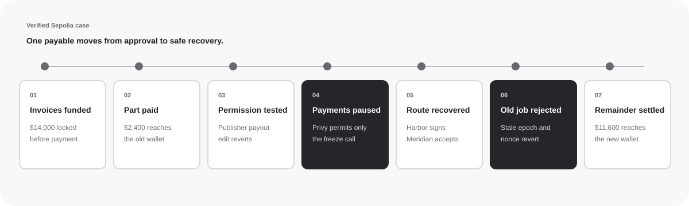
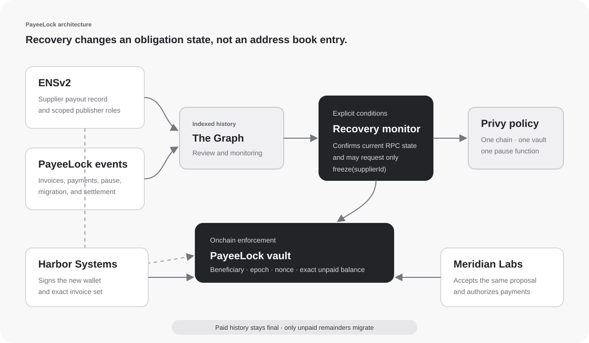

<p align="center">
  
</p>

<p align="center"><strong>Safe recovery for approved onchain payments.</strong></p>

<p align="center">
  <a href="https://payeelock-sentinel.vercel.app">Live app</a> ·
  <a href="https://payeelock-sentinel.vercel.app/?mode=use">Create a vault</a> ·
  <a href="docs/demo.md">Demo guide</a> ·
  <a href="docs/submission.md">Submission draft</a> ·
  <a href="#verified-sepolia-case">Verified case</a> ·
  <a href="#how-recovery-works">How it works</a> ·
  <a href="#run-locally">Run locally</a> ·
  <a href="docs/threat-model.md">Threat model</a>
</p>

PayeeLock protects an approved invoice after the supplier's payout wallet becomes unsafe. Payments pause, the supplier signs one exact recovery proposal, and the buyer accepts that same proposal onchain. Only the unpaid balance moves to the replacement wallet. Previously paid value stays final, and every old payment authorization becomes unusable.

The repository includes a completed Ethereum Sepolia case with three funded invoices, a valid partial payment, a constrained Privy guardian freeze, bilateral recovery, a deliberately replayed payment that reverts, and final settlement to the replacement wallet.

<table align="center">
  <tr>
    <td align="center"></td>
    <td align="center"></td>
    <td align="center"></td>
    <td align="center"></td>
  </tr>
  <tr>
    <td align="center">Ethereum</td>
    <td align="center">ENSv2</td>
    <td align="center">Privy</td>
    <td align="center">The Graph</td>
  </tr>
</table>

## The problem

A valid invoice can still pay the wrong wallet. A supplier may report a compromised payout key after an invoice is approved or partly paid, while old signed payment jobs are already waiting to execute.

Updating an address book is not enough. It does not define what happens to partially paid invoices, queued signatures, or the authority to select a replacement recipient.

PayeeLock makes that recovery a contract-enforced state transition:

| Boundary           | Guarantee                                                                                                        |
| ------------------ | ---------------------------------------------------------------------------------------------------------------- |
| Prefunded invoice  | Approved value enters the vault before it becomes payable                                                        |
| ENSv2 permissions  | An invoice publisher cannot also rewrite the payout address                                                      |
| Privy policy       | The guardian may call only `freeze(bytes32)` on the configured deployment                                        |
| Bilateral recovery | The supplier proposes the replacement; the buyer accepts the exact same invoice set                              |
| Execution checks   | Beneficiary, epoch, nonce, amount, expiry, chain, contract, signer, and freeze state are checked when funds move |

The recovery monitor is deliberately simple. It reads indexed history from The Graph, confirms current state over Sepolia RPC, and can request a pause. It cannot transfer funds, select a recipient, migrate invoices, cancel invoices, or complete recovery.

## Verified Sepolia case

Meridian Labs is the buyer. Harbor Systems supplied cloud infrastructure and security services. Meridian prefunded three approved Harbor invoices totaling 14,000 MockUSDC.

```text
$2,400  paid normally to Harbor's original wallet
$11,600 paid after recovery to Harbor's replacement wallet
$0      left reserved in the vault
```

The machine-readable evidence bundle is [`deployments/sepolia-proof.json`](deployments/sepolia-proof.json).

| Evidence              | Public result                                                                                                                 |
| --------------------- | ----------------------------------------------------------------------------------------------------------------------------- |
| PayeeLock vault       | [`0x1590…deb6`](https://sepolia.etherscan.io/address/0x1590ee40de98affa90d748e8b5eab6fc5a8ddeb6)                              |
| ENSv2 name            | `payeelock-sentinel.eth`                                                                                                      |
| Permissioned Resolver | [`0x2368…e06F9`](https://sepolia.etherscan.io/address/0x2368D210C506de631780863062C48c75695e06F9)                             |
| Privy guardian        | [`0x41A2…6B9e`](https://sepolia.etherscan.io/address/0x41A23e86B410C28A02594F12a9DEFE28B22a6B9e)                              |
| Guardian freeze       | [Confirmed transaction](https://sepolia.etherscan.io/tx/0x9ecb6a758e604e9416f0af6d67775df762b0707f10ba84205610967da304c0b8)   |
| Old authorization     | [Reverted after recovery](https://sepolia.etherscan.io/tx/0x55d28df79cd2c303a82a58f84ed4a44af743540872e9317940d691e4a035983b) |
| Final settlement      | [Confirmed transaction](https://sepolia.etherscan.io/tx/0x9a7b034b92d78de50cc8e106ec7689d3803a08521717d0872123f9a37554270d)   |
| Indexed history       | [Live Subgraph Studio deployment](https://thegraph.com/studio/subgraph/payeelock-sentinel/)                                   |

The public app has two modes. **Use PayeeLock** is the product: connect a wallet and the page deploys your own vault, where your wallet is the buyer. You register a supplier, prefund an invoice, pay it with a signed authorization, pause the supplier, and complete bilateral recovery. **Review case** is the read-only walkthrough of the completed Meridian Labs and Harbor Systems case; its controls move between already-mined events and never submit a transaction.

Each workspace is its own vault. `BUYER` is fixed at construction, so your vault is the only one your wallet can fund, pause, and settle. The Meridian deployment is one such vault, kept as the verified example; it is not shared custody.

A live example workspace created through the public factory is vault [`0x4892…6287`](https://sepolia.etherscan.io/address/0x48926b53983Fc9b6c9433903298e1a14eD6d6287) with resolver [`0xF556…6dAE`](https://sepolia.etherscan.io/address/0xF556ac7e5d77C6E79e4d6996F628B2768a7D6dAE).

The verified case uses a Privy guardian under a default-deny policy. A workspace you create in the browser starts with your own wallet as buyer, guardian, and recovery signer, which you can reassign with `setGuardian` and `setExecutor`.

## How recovery works

<p align="center">
  
</p>

1. Meridian prefunds three approved Harbor invoices.
2. A valid 2,400 MockUSDC installment reaches Harbor's original wallet.
3. A separate ENSv2 permission test proves the invoice-publishing key cannot edit the payout address.
4. The constrained Privy guardian pauses Harbor's outstanding payments.
5. Harbor signs the replacement wallet and exact three-invoice set. Meridian accepts that proposal onchain.
6. PayeeLock increments the supplier epoch and every migrated invoice nonce. The old queued payment now reverts.
7. Fresh authorizations settle only the 11,600 MockUSDC unpaid remainder to Harbor's replacement wallet.

The invoices do not move to a wallet. Their prefunded value stays in PayeeLock until a valid payment executes.

## What is new

PayeeLock begins after the normal accounts-payable happy path: the invoice is already approved, some value may already be paid, and the current payout route is no longer safe.

| Existing approach                                       | What it already handles                                    | What PayeeLock adds                                                                                                      |
| ------------------------------------------------------- | ---------------------------------------------------------- | ------------------------------------------------------------------------------------------------------------------------ |
| [Remit](https://ethglobal.com/showcase/remit-m1i0b)     | Exact payment digests and human approval for risky changes | Recovery of an existing unpaid obligation, with partial-payment preservation and invalidation of every old authorization |
| [PayFlow](https://ethglobal.com/showcase/payflow-jg28k) | Invoice parsing, ENS identity, and cross-chain routing     | A contract transition over the exact unpaid invoice set instead of paying whichever address currently resolves           |
| Vendor allowlist                                        | Checks whether a destination is approved                   | Per-invoice beneficiary, epoch, and nonce checks plus approval from both sides of the obligation                         |
| Treasury multisig                                       | Requires multiple signers for a transaction                | Preserves invoice accounting and makes stale jobs fail automatically after recovery                                      |

PayeeLock does not claim to parse invoices, identify real-world companies, recover funds already transferred, or decide whether an incident report is truthful.

## Architecture

<p align="center">
  
</p>

The Solidity vault is chain-agnostic and can deploy on any EVM network with a standard ERC-20 and compatible resolver. Every deployment is intentionally chain-specific: EIP-712 signatures bind the chain ID and contract address. The verified submission instance uses Sepolia because ENSv2 is available there for ETHOnline 2026.

The Graph supplies queryable history for review and monitoring. Current RPC state and PayeeLock's execution-time checks remain authoritative, so indexer lag cannot redirect a payment.

See [`docs/architecture.md`](docs/architecture.md) for the state model and [`docs/threat-model.md`](docs/threat-model.md) for the exact trust boundary.

## Integrations

### ENSv2

The case uses the official ENSv2 Sepolia registry and a Permissioned Resolver. Harbor's publisher can maintain an invoice text record but cannot edit the payout address. The independently controlled recovery authority performs the later address change used by the accepted recovery proposal.

### Privy

The PayeeLock guardian is a Privy server wallet under a default-deny policy. Its allow rule is limited to one chain, one contract, and one function: `freeze(bytes32)`. A separate denial probe attempts a harmless transfer and succeeds only when Privy rejects it before broadcast.

### The Graph

The deployed Subgraph indexes PayeeLock suppliers, invoices, payments, freezes, migrations, and ENSv2 record and role events. The application consumes this live endpoint as evidence infrastructure. The Graph is not an execution oracle and is not presented as an AI integration.

Receipts, policy details, Subgraph deployment information, and verification commands are collected in [`docs/integration-evidence.md`](docs/integration-evidence.md).

## Run locally

Requirements: Node.js 22+, npm, and [Foundry](https://getfoundry.sh).

```bash
npm ci
cp .env.example .env.local
npm run dev
```

Set `SEPOLIA_RPC_URL` in `.env.local`, then open [http://127.0.0.1:3126](http://127.0.0.1:3126). The case review needs no wallet. The workspace flow needs an injected Ethereum wallet on Sepolia, because every action is a transaction you sign.

Open [http://127.0.0.1:3126/?mode=use](http://127.0.0.1:3126/?mode=use) to go straight to the workspace. With the factory configured, creating a workspace is one transaction that deploys your vault and its payout resolver. Then mint test dollars, register a supplier, prefund an invoice, and pay it.

`PayeeLockFactory` is deployed on Sepolia at [`0xf768…fd15`](https://sepolia.etherscan.io/address/0xf76802b72f97c21da6d2934034061f06d0eefd15) and creates the vault and its resolver in one transaction with the caller as buyer. A public open-mint test token at [`0x8c92…0066`](https://sepolia.etherscan.io/address/0x8c9270053298bcfdb77a73c27f65ad9b53250066) supplies trial funds. If those variables are absent, the app falls back to deploying a token, resolver, and vault directly from the visitor's wallet.

### Reproduce the protocol lifecycle

```bash
bash tooling/bootstrap.sh
npm run test:e2e
```

This starts an isolated Anvil network, deploys fresh fixtures, exercises successful and reverted transactions, checks final balances, and shuts the process down. Anvil is test infrastructure, not a separate product mode.

### Run the complete verification suite

```bash
npm run verify
npm run graph:build
npm run monitor:inspect
npm run guardian:status
npm run guardian:policy-test
```

Commands that query Privy, The Graph, or Sepolia require the corresponding private values in `.env.local`. Secrets are ignored by Git; only placeholders belong in `.env.example`.

`npm run verify` checks repository structure and local documentation links, type-checks the application and scripts, runs the Foundry and isolated lifecycle suites, compiles the Subgraph, creates a production Next.js build, and verifies formatting.

## Contract guarantees

- Invoice value enters the vault before the obligation becomes payable.
- Payment cannot exceed the unpaid invoice amount.
- The beneficiary, resolver value, epoch, nonce, expiry, signer, chain, contract, and freeze state are checked at execution.
- Recovery binds the replacement beneficiary and hash of the exact invoice list.
- Recovery preserves paid history and increments every migrated invoice nonce.
- Old-epoch, replayed, expired, and already-used authorizations revert.
- Fee-on-transfer assets are rejected through exact balance-delta checks.
- The guardian has no payment, migration, cancellation, withdrawal, or unfreeze authority.

The Foundry suite contains 23 tests, including 512 fuzz cases for partial-payment accounting, factory ownership isolation, resolver authority separation, and a full factory workspace lifecycle. The isolated end-to-end runner adds ten lifecycle assertions against fresh local deployments.

## Repository map

```text
apps/
  web/                          deployable Next.js product and case review
    src/components/payeelock-workspace.tsx   wallet-driven vault console
    src/components/payeelock-dashboard.tsx   read-only case review
    src/lib/payeelock-case.ts     server-side Sepolia and Subgraph read model
    public/                     browser-served integration marks
packages/
  contracts/                    Foundry protocol workspace
    src/PayeeLock.sol           payment and recovery protocol
    src/PayeeLockFactory.sol    permissionless vault and resolver factory
    src/WorkspaceResolver.sol   resolver for vaults without an ENSv2 name
    test/                       unit, adversarial, replay, fuzz, and factory tests
    generated/                  committed TypeScript ABI modules
    test-support/               isolated lifecycle controller and typed data
  subgraph/                     Graph workspace
    schema.graphql              indexed payment and authority entities
    src/                        PayeeLock and ENSv2 event mappings
deployments/
  sepolia-proof.json            public evidence bundle
tooling/
  e2e.ts                        isolated lifecycle acceptance test
  recovery-monitor.ts           Graph inspection, RPC confirmation, optional pause
  privy-guardian.ts             guardian policy status, denial probe, and pause action
docs/
  architecture.md              protocol state and authority boundaries
  build-status.md              completion state and optional polish
  demo.md                      walkthrough production and disclosure notes
  design-system.md             interface language and visual rules
  integration-evidence.md      public ENSv2, Privy, and Graph evidence
  ai-use.md                    exact development-assistance disclosure
  provenance.md                dependencies, prior art, and asset sources
  submission.md                ETHGlobal form copy and final checklist
  threat-model.md              enforced assumptions and known limits
  validation.md                reproducible checks and observed results
  assets/                      project diagrams and sourced integration marks
```

The root is an orchestration layer, not a fourth application. Turborepo builds the independently deployable web, contract, and Subgraph workspaces in dependency order. The committed contract ABI is owned by `@payeelock/contracts` and consumed by `@payeelock/web`, so interface drift becomes a build failure instead of a silent copy.

## Limits

PayeeLock is an unaudited hackathon prototype and must not hold production funds.

- The buyer can cancel an unpaid remainder; this is prefunded payable escrow, not guaranteed supplier credit.
- A transfer finalized before the freeze cannot be recovered.
- A compromised guardian can cause denial of service by freezing, but cannot redirect or withdraw funds.
- A compromised buyer and supplier recovery signer together can redirect unpaid invoices.
- Resolver and recovery-signer rotation are not implemented.
- Only standard non-rebasing ERC-20 behavior is supported.
- The Subgraph is deployed to Studio, not published to the decentralized Graph Network.
- The monitor uses explicit conditions. It does not infer incidents, establish identity, or replace human recovery approval.

Tests prove the implemented cases; they are not a substitute for an audit.

## Development disclosure

The product, contracts, interface, diagrams, and tests were developed for ETHOnline 2026 with AI-assisted research and coding under the builder's direction. No previous winner's project-specific code was copied. [`docs/ai-use.md`](docs/ai-use.md) lists where assistance was used, and [`docs/provenance.md`](docs/provenance.md) records the repositories and products reviewed during development.

The earlier ERC-8004 experiment is not a dependency, prize target, or product claim. Its already-mined Sepolia registration remains historical onchain evidence, while the submission architecture relies only on PayeeLock, ENSv2, Privy, The Graph, and Ethereum.

## License

Original project code is MIT licensed. Third-party dependencies and organization marks retain their respective licenses and trademarks. Their appearance identifies an integration and does not imply endorsement.
